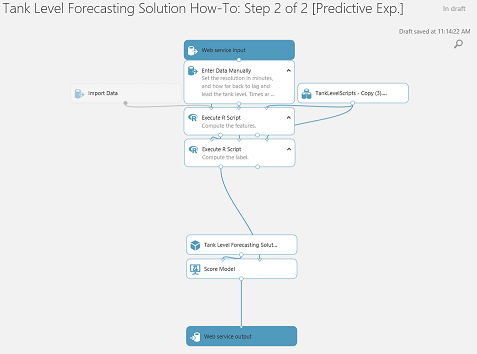

The deployment guide below provides a full set of instructions on how to put together and deploy a tank level forecasting solution using the Cortana Intelligence Suite.

**For technical problems or questions about deploying this solution, please post in the issues tab of the repository.**

# Deployment Guide #

Forecasting the amount of a substance that will be in a container some time from now is a time series problem.  We describe a solution that uses Cortana Intelligence to predict the level in a tank used for temporary storage at a processing facility. We explain how to build the solution piece by piece, and in many cases explains why certain decisions were made. The manual process gives an implementer an inside view on how the solution is built and an understanding of its components.

# Table of Contents #

- [Architecture](#architecture)
- [Requirements](#requirements)
- [Setup steps](#setup-steps)
	- [Install the software](#install-the-software)
	- [Clone the Tank Level Forecasting repository](#clone-the-repository)
	- [Create an Azure SQL database](#create-an-azure-sql-database)
	- [Publish the Tank Level database](#publish-the-database)
	- [Create an Azure Machine Learning workspace](#create-an-aml-workspace)
	- [Add the Tank Level Forecasting experiments](#add-the-experiments)
	- [Run the Tank Level Forecasting experiments](#run-the-experiments)
	- [Create a Power BI subscription](#create-a-power-bi-subscription)
	- [Retrain the Tank Level Forecasting model](#retrain-the-model)

# Architecture<a name="architecture"></a> #

[Figure 1](#Figure1) shows the overall architecture of the Tank Level Forecasting Solution How-To.

<br/>
<a name="Figure1">*Figure 1 Tank Level Forecasting Solution Architecture*</a>

# Requirements<a name="requirements"></a> #

You will need the following to create this solution:

- A network connection.
- The following software:
  - [Microsoft ODBC Driver 11 for SQL Server - Windows](https://www.microsoft.com/en-us/download/details.aspx?id=36434).
  - [Microsoft Command Line Utilities 11 for SQL Server](https://www.microsoft.com/en-us/download/details.aspx?id=36433).
  - [Microsoft Visual Studio 2015 Update 3](https://msdn.microsoft.com/en-us/library/e2h7fzkw.aspx).
  - [R Tools for Visual Studio](https://www.visualstudio.com/vs/rtvs).
  - [Microsoft R Open](https://mran.microsoft.com/open).
  - [Power BI Desktop](https://powerbi.microsoft.com/desktop).
- An [Azure Resource Group](https://azure.microsoft.com/documentation/articles/resource-group-overview).
- An [Azure SQL Database](https://azure.microsoft.com/services/sql-database).
- An [Azure Storage Account](https://azure.microsoft.com/documentation/articles/storage-introduction).
- An [Azure Machine Learning](https://studio.azureml.net) workspace.
- A [Power BI](https://powerbi.microsoft.com) subscription.

# Setup steps<a name="setup-steps"></a> #

We walk the reader through the creation and linking of many different Cortana Intelligence Suite services, with the end result of replicating the architecture shown in [Figure 1](#Figure1). For simplicity and convenience, we suggest that the Azure resources you create be grouped under a single Azure Resource Group.

You will be providing names for the resource group and for resources. In Microsoft Azure, these can be between 3 and 24 characters, and use numbers and lower case letters. We suggest that you chose a common prefix such as *tanklevel* to name the resource group and each of the different resources. And when the name of a resource must be unique to Microsoft Azure, we suggest that you chose a five digit common suffix such as *12345* to make it unique. At least the names for the following should be unique: resource group, SQL server, storage account.

You will be selecting locations for some of the resources. We suggest that you locate the various resources in the same region for efficiency. Below, we will assume you select the ***South Central US*** region.

## Install the Software<a name="install-the-software"></a> ##

You will install and configure the following software:

- Microsoft ODBC Driver 11 for SQL Server - Windows,
- Microsoft Command Line Utilities 11 for SQL Server,
- Microsoft Visual Studio 2015 (VS15),
- R Tools for Visual Studio (RTVS),
- Microsoft R Open (MRO), and
- Power BI Desktop (PBID).

The first two software components are used for quickly loading data into the SQL database. VS15 will be used to set up and manage the SQL database, and execute parts of the solution. MRO is the R programming environment used to create, test, and run some of the R scripts used by the solution, and RTVS extends VS15 to make it an excellent R environment. Finally, Power BI is the visualization environment used to explore forecasts.

First, install Microsoft ODBC Driver 11 for SQL Server - Windows:

- Go to the [Microsoft ODBC Driver 11 for SQL Server - Windows](https://www.microsoft.com/en-us/download/details.aspx?id=36434) site.
- Download the version of the package, x64 or x86, appropriate for your computer.
- When your download is complete, run the installer.
- Follow the instructions until the setup is complete.

Similarly, install [Microsoft Command Line Utilities 11 for SQL Server](https://www.microsoft.com/en-us/download/details.aspx?id=36433).

Install Microsoft Visual Studio 2015 pdate 3 (VS15):

- Go to the [VS15](https://msdn.microsoft.com/en-us/library/e2h7fzkw.aspx) site.
- Download a version of VS15, such as the free Community 2015 edition.
- When your download is complete, run the installer.
- Follow the instructions until the setup is complete. During the setup, make sure the following features are selected:
  - ***Windows and Web Development > Microsoft SQL Server Data Tools***,
  - ***Common Tools > Git for Windows***,
  - ***Common Tools > Github Extension for Visual Studio***, and
  - ***Common Tools > Visual Studio Extensibility Tools Update 3***.

**NOTE:** If VS15 is already installed, you can make sure that the above features are installed by doing the following:

- Open your computer's ***Programs and Features*** control panel.
- Select your version of VS15.
- Click ***Change***, and wait for the dialog to update.
- Click ***Modify***.
- Make sure the following features are selected:
  - ***Windows and Web Development > Microsoft SQL Server Data Tools***,
  - ***Common Tools > Git for Windows***,
  - ***Common Tools > Github Extension for Visual Studio***, and
  - ***Common Tools > Visual Studio Extensibility Tools Update 3***.
- Click ***OK***.

Install [R Tools for Visual Studio](https://www.visualstudio.com/vs/rtvs) (RTVS).

Install [Microsoft R Open](https://mran.microsoft.com/open) (MRO) (if you did not install it during RTVS setup.)

Verify that VS15 is configured to use MRO, and install the required MRO packages:

- In VS15, open ***R Tools > Windows > R Interactive***.
- Verify that the startup text mentions MRO. If not:
  - Go to ***R Tools > Windows > Workspaces***.
  - If the MRO you installed is not listed as a local engine:
    - Click ***Add***.
    - Under *Entry Name*, type a unique name for this MRO.
    - Next to *Host URL or path to R installation*, type the path to the directory where MRO was installed, such as:<br/>
      ```dosbatch
      C:\Program Files\Microsoft\R Open\R_SERVER
      ```
    - Click ***Save***.
  - If the MRO you installed is not the connected version of R (i.e. **bold**), connect to it by clicking the arrow icon.
    - If you are asked whether you are sure you want to change connections, click ***Yes***.
- To install the required packages, run the command:<br/>
  ```R
  install.packages(c('RCurl', 'rjson', 'zoo', 'RODBC'))
  ```

Finally, install [Power BI Desktop](https://powerbi.microsoft.com/desktop).

## Clone the Tank Level Forecasting repository<a name="clone-the-repository"></a> ##

The repository contains data, R code, and documentation for the solution.

- Go to the [Tank Level Forecasting](https://github.com/azure/oil-tank-forecasting-guide) repository.
- In the ***Code*** tab, click ***Clone or download***.
- Click ***Open in Visual Studio***.
- Once VS15 is open and shows the repository cloning dialog, click ***Clone***.

## Create an Azure SQL database<a name="create-an-azure-sql-database"></a> ##

You will create and configure the Azure SQL Database to contain the inputs to and outputs from the machine learning experiments. As a side-effect, you will also be creating an Azure Resource Group.

- Go to [Azure Portal](https://portal.azure.com), and login to your account.
- On the left tab click ***New > Databases > SQL Database***.
- Set
  - ***Database name*** to *tankleveldatabase*, and
  - ***Resource group*** to ***Create a new***, and give it the name *tanklevelresources12345*.
- Click ***Server***, and do the following:
  - Click ***+ Create new server***.
  - Set
    - ***Server name*** to *tanklevelserver12345*,
    - ***Server admin login*** to *tanklevel*,
    - ***Password*** to something you will remember,
    - ***Confirm Password*** to the password you selected, and
    - ***Location*** to ***South Central US***.
  - Click ***Select***.
- Once returned to the ***SQL Database*** tab, click ***Create***.
- Wait for the database and server to be created (about 2 minutes).

Configure the server's firewall for access from your computer:

- In [Azure Portal](https://portal.azure.com)'s left-most column click ***Resource groups***.
- In the list of resource groups, click *tanklevelresources12345*.
- In the list of resources, click *tanklevelserver12345*.
- In the blade that opens, under ***Settings***, click ***Firewall***.
- In the blade that opens, in the toolbar at the top, click ***+ Add client IP***.
- Click ***Save***.

Copy the server's login information to the *TankLevelDatabase.json* file for access from R:

- In VS15, open ***View > Team Explorer***.
- Under ***Local Git Repositories***, open *oil-tank-forecasting-guide*.
- Under ***Solutions***, open *oil-tank-forecasting-guide*.
- Open ***View > Solution Explorer***.
- Navigate to *R > Data*.
- Open *TankLevelDatabase.json*.
- Set the value of
  - *Server* to *tanklevelserver12345.database.windows.net*,
  - *Database* to *tankleveldatabase*,
  - *Login* to *tanklevel*, and
  - *Password* to the password you selected.
- Save the file.

## Publish the Tank Level database<a name="publish-the-database"></a> ##

This creates the database tables needed to store the Internet of Things sensor data, and the machine learning forecasts. Then, it generates simulated sensor data from a number of facilities, and loads it into the database table *TankLevelSensor*.

### Publish the database ###

Connect to the Azure SQL database:

- In VS15, open ***View > SQL Server Object Explorer***.
- Click on the *Add SQL Server* icon.
- In the ***Connect*** dialog that comes up, open the list of Azure servers.
- In the dialog's search box, type *tankleveldtabase*.
- Click on the *tankleveldatabase* that goes with *tanklevelserver12345*.
- In the bottom panel, set
  - ***Server Name*** to *tanklevelserver124345.database,windows.net*,
  - ***Authentication*** to ***SQL Server Authentication***,
  - ***User Name*** to *tanklevel*,
  - ***Password*** to the password you selected, and
  - ***Remember Password*** to check mark for convenience.
- Click ***Connect***.
- Wait for the ***SQL Server Object Explorer*** window to show *tanklevelserver12345*.

Publish the database project to the database:

- In VS15, open ***View > Solution Explorer***.
- Right-click *SQL Server*, and select ***Build***.
- Right-click *SQL Server*, and select ***Publish***.
- In ***Target database settings***, next to ***Target database connection***, click ***Edit***.
- In the ***History*** tab, select the *tankleveldatabase* of *tanklevelserver12345* and click ***Test Connection***.
  - If the result is a success, click ***OK***.
  - Otherwise, ***Show Connection Properties***.
  - Correct the connection properties, and try again.
- Click ***OK***.
- Click ***Publish***, and wait for the publication to complete successfully.

Verify that the needed tables exist:

- In VS15, open ***View > SQL Server Object Explorer***.
- Navigate to *tanklevelserver12345 > **Databases** > tankleveldatabase > **Tables***, and wait for the list to refresh.
- In addition to other items, you should see the tables *dbo.TankLevelForecast* and *dbo.TankLevelSensor*.

### Load the data ###

In *oil-tank-forecasting-guide > R*, source the file *TankLevelSensor.R* to generate and load the sensor data:

- In VS15 ***Solution Explorer***, navigate to *R > TankLevelSensor.R*.
- Right-click *TankLevelSensor.R*, and select ***Source Selected File(s) with Echo***.
- Wait until the loading is complete (about 8 minutes).
  - The loading app should print a running update of the number of records loaded so far.
  - At times, loading will pause for as much as 5 minutes before proceeding again.

After the loading is complete, you can view the data in the table.

- In VS15 ***SQL Server Object Explorer***, navigate to *tanklevelserver12345 > **Databases** > tankleveldatabase > **Tables***.
- Right-click *dbo.TankLevelSensor*, and select ***View Data***.

If loading does not complete successfully, you may need to reload the data. In that case, you should first delete the contents of the *dbo.TankLevelSensor* doing the reload.

While the loading is happening, you may proceed, but do not start the [Run the oil-tank-forecasting-guide experiments](#run-the-experiments) step.

## Create an Azure Machine Learning workspace<a name="create-an-aml-workspace"></a> ##

You will create the Azure Machine Learning (AML) workspace to contain the experiments that train models and forecast tank levels. As a side-effect, you will also be creating an Azure Storage Account, and in that storage account, you will create a container to store retrained models.

First, create an AML workspace:

- In [Azure Portal](https://portal.azure.com), click ***New > Intelligence + Analytics > Machine Learning Workspace***.
  - If ***Machine Learning Workspace*** is not visible,
    - click ***See all***,
    - type *Machine Learning Workspace* in the search box, and press the *Enter* key,
    - click ***Machine Learning Workspace***, and
    - click ***Create***.
- In the blade that opens, set
  - ***Workspace name*** to *tanklevelworkspace*,
  - ***Resource group*** to ***Use existing***, and select *tanklevelresources12345*,
  - ***Location*** to ***South Central US***,
  - ***Storage account*** to ***Create new***, and give it the name *tanklevelstorage12345*, and
  - ***Web service plan*** to ***Create new***, and give it the name *tanklevelplan*.
- Click ***Web service plan pricing tier***, and in the blade that opens:
  - click on an available pricing plan, such as *S1 Standard*, and
  - click ***Select***.
- Once returned to the ***Machine Learning Workspace*** tab, click ***Create***.

Create a container in the Azure Storage Account:

- In [Azure Portal](https://portal.azure.com), on the left tab click ***Resource groups***.
- In the list of resource groups, click *tanklevelresources12345*.
- In the list of resources, click *tanklevelstorage12345*.
- In the left-most blade column, under ***BLOB SERVICE***, click ***Containers***.
- In the blade, click ***+ Container*** to add a container.
- In the blade that opens, set ***Name*** to *retraining*.
- Click ***Create***.

Copy the storage's authorization information to the *TankLevelStorage.json* file for access from R:

- In the left-most blade column, under ***SETTINGS***, click ***Access keys***.
- From the table, copy
  - ***Storage account name*** to the value of *AccountName*, and
  - ***key1*** to the value of *AccountKey*.
- Save the file.

## Add the Tank Level Forecasting experiments<a name="add-the-experiments"></a> ##

You will add two experiments to the workspace.

Add to the workspace the Tank Level Forecasting experiments from the Gallery:

- Go to [AML Studio](https://studio.azureml.net), and login to your account.
- Go to the [Tank Level Forecasting Solution How-To: Step 1 of 2](http://gallery.cortanaintelligence.com/Experiment/Tank-Level-Forecasting-Solution-How-To-Step-1-of-2-1) experiment.
- Click ***Open in Studio***.
- In the ***Copy Experiment*** dialog, set
  - ***Region*** to ***South Central US***, and
  - ***Workspace*** to *tanklevelworkspace*.
- Click the check mark button.
- Wait for the experiment to open in the requested workspace (about 1 minute).

You may see the message that the experiment is being updated after it has been copied.

Repeat the above steps to add the [Tank Level Forecasting Solution How-To: Step 2 of 2](http://gallery.cortanaintelligence.com/Experiment/Tank-Level-Forecasting-Solution-How-To-Step-2-of-2-2) experiment.

## Run the Tank Level Forecasting experiments<a name="run-the-experiments"></a> ##

**NOTE:** Wait until the sensor table data is completely loaded before starting this step.

### Find the best learner module ###

The *Tank Level Forecasting Solution How-To: Step 1 of 2* is used to find which learner provides the best results when forecasting the tank level time series. You will navigate to the experiment, configure it, and run it:

- In [AML Studio](https://studio.azureml.net), navigate to your copy of *Tank Level Forecasting Solution How-To: Step 1 of 2*.
- Click on the ***Import Data*** module.
- Set
  - ***Data source*** to ***Azure SQL Database***,
  - ***Database server name*** to *tanklevelserver12345.database.windows.net*,
  - ***Database name*** to *tankleveldatabase*,
  - ***User name*** to *tanklevel*,
  - ***Server user account password*** to the password you selected, and
  - ***Use cached results*** to be checked.
- Click ***RUN*** at the bottom of the page.
- Wait for the experiment to finish running (about 16 minutes).

Once the experiment has finished running, it will look like the image shown in [Figure 2](#Figure2).

<br/>
<a name="Figure2">*Figure 2 Tank Level Forecasting Solution How-To: Step 1 of 2*</a>

Find the learner with the best results:

- Right-click the ***Execute R Script*** *Compute performance* module at the bottom of the experiment, and select ***Result Dataset > Visualize***.
- In the table's ***Mean Absolute Percentage Error*** column, find the row with the smallest positive value, and note the corresponding name in the ***Algorithms*** column.

The image should be similar to that shown in [Figure 3](#Figure3). In the figure, the lowest value is *0.045237* and the algorithm is *Decision Forest*.

<br/>
<a name="Figure3">*Figure 3 Tank Level Forecasting Performance Values*</a>

### Create the forecasting web service ###

- Go back to the experiment.
- Right-click the module corresponding to the best algorithm, and select ***Copy***.

The *Tank Level Forecasting Solution How-To: Step 2 of 2* is used to create a model that can be used in forecasting, create a predictive experiment that will make forecasts, and create a retraining experiment to create new models on future data. You will navigate to the experiment, configure it, and run it:

- In [AML Studio](https://studio.azureml.net), navigate to your copy of *Tank Level Forecasting Solution How-To: Step 2 of 2*.
- Paste into the experiment the module you had copied.
- Wire up the copied module to the ***Train Model*** module's ***Untrained model*** input.
- Click on the ***Import Data*** module.
- Set
  - ***Data source*** to ***Azure SQL Database***,
  - ***Database server name*** to *tanklevelserver12345.database.windows.net*,
  - ***Database name*** to *tankleveldatabase*,
  - ***User name*** to *tanklevel*,
  - ***Server user account password*** to the password you selected, and
  - ***Use cached results*** to be checked.
- Click ***RUN*** at the bottom of the page.
- Wait for the experiment to finish running (about 1 minute).

You will use the experiment to create a predictive experiment, configure it, and run it:

- Click ***SET UP WEB SERVICE*** at the bottom of the page, and choose ***Predictive Web Service***.
- You should get a predictive experiment similar to the one in [Figure 4](#Figure4).

<br/>
<a name="Figure4">*Figure 4 Tank Level Forecasting Predictive Experiment*</a>

- Delete the ***Web service input*** and ***Web service output*** modules.
- Delete the ***Execute R Script*** module with the words *Compute the label*.
- Wire the ***Execute R Script*** module with the words *Compute the features* to the right-most input of the ***Apply Transformation*** module.
- Select the ***Score Model*** module, and select the ***Append score columns to output*** option.
- Click ***RUN*** at the bottom of the page.
- Wait for the experiment to finish running (about 1 minute).

Find the name of the column that has the forecast, and use it to export the data.

- Right-click on the ***Score Model*** module, and select ***Scored Dataset > Visualize***.
- Scroll the window horizontally until you are at the last column of the data.
- Note the name of the column immediately to the right of the *TankLevelLag180* column; it should be something like ***Scored Label*** or  ***Scored Label Mean***.
- Return to the experiment.
- Add an ***Export Data*** module to the experiment.
- Wire it to the ***Score Model*** module.
- Click on the ***Export Data*** module.
- Set
  - ***Data source*** to ***Azure SQL Database***,
  - ***Database server name*** to *tanklevelserver12345.database.windows.net*,
  - ***Database name*** to *tankleveldatabase*,
  - ***User name*** to *tanklevel*,
  - ***Server user account password*** to the password you selected,
  - ***Comma separated list of columns to be saved*** to *FacilityId,Time,TankLevel,Scored Label*, where you replace the name *Scored Label* with the name of the forecast column you just found,
  - ***Data table name*** to *tanklevelforecast*, and
  - ***Comma separated list of datatable columns*** to *FacilityId,Time,TankLevel,TankLevelForecast*.

Your predictive experiment should now look like to the one in [Figure 5](#Figure5).

<br/>
<a name="Figure5">*Figure 5 Configured Tank Level Forecasting Predictive Experiment*</a>

Create the predictive web service from the predictive experiment, and then add to it a forecasting endpoint.

- Click ***RUN*** at the bottom of the page.
- Wait for the experiment to finish running (about 4 minutes).
- Click ***DEPLOY WEB SERVICE*** at the bottom of the page, and choose ***Deploy Web Service [Classic]***.
- If you are warned that the web services does not have web inputs or outputs, click ***Yes***.

The browser will redirect to the web service home page.

- At the bottom of the page on the left, click ***Manage endpoints***.
- From the toolbar, click ***+ NEW***.
- Set the ***Name*** to *tanklevelforecasting*.
- Click ***Save***.
- Wait for the endpoint to be added (less than a minute).

Copy the endpoint's forecasting authorization information to the *TankLevelForecasting.json* file for access from R:

- Click *tanklevelforecasting* in the list of endpoints.
- From the menu bar, click ***Consume***.
- Copy
  - ***Primary Key*** to *Api Key*.
  - ***Batch Requests*** to *Url*.
- Delete from the end of the uri the string ***/jobs?api-version=2.0***.
- Save the file.
- 
### Create the retraining web service ###

*Important Note:* While the previous predictive web service was deployed from a predictive experiment, the retraining web service is deployed from a training experiment. You will still need information from the predictive web service in order to update it using the retrained model.

Copy the tanklevelforecasting endpoint's update authorization information to the *TankLevelUpdating.json* file for access from R:

- Click *tanklevelforecasting* in the list of endpoints.
- From the menu bar, click ***Consume***.
- Copy
  - ***Primary Key*** to *Api Key*.
  - ***Patch*** to *Url*.
- Under the ***Patch*** Url, click ***API HELP***.
- Under ***Updatable Resources***, copy the ***Resource Name*** to *Name*.
- Save the file.
 
Create the retraining web service from the training experiment.

- Navigate to your *Tank Level Forecasting Solution How-To: Step 2 of 2*.
- Add an ***Web Service Output*** module to the experiment.
- Wire it to the output of the ***Train Model*** module.
- Add another ***Web Service Output*** module to the experiment.
- Wire it to the left output of the ***Execute R Script*** module with the words *Compute performance metrics*.
- Click ***RUN*** at the bottom of the page.
- Wait for the experiment to finish running (about 4 minutes).
- Click ***SET UP WEB SERVICE*** at the bottom of the page, and choose ***Deploy Web Service [Classic]***.
- If you are warned that the web services does not have web inputs or outputs, click ***Yes***.

The browser will redirect to the web service home page. Copy the web service's authorization information to the *TankLevelRetraining.json* file for access from R:

- At the bottom of the page on the left, click ***Manage endpoints***.
- Click *default* in the list of endpoints.
- From the menu bar, click ***Consume***.
- Copy
  - ***Primary Key*** to *Api Key*.
  - ***Batch Requests*** to *Url*.
- Delete from the end of the uri the string ***/jobs?api-version=2.0***.
- Save the file.

## Create a Power BI subscription<a name="create-a-power-bi-subscription"></a> ##

- Go to the [Power BI](https://powerbi.microsoft.com) site.
- Click ***Get started for free***.
- In the ***Power BI*** box, click ***Sign up***.
- Follow the instructions.

**NOTE:** Wait until experiment *Tank Level Forecasting Solution How-To: Step 2 of 2 [Predictive exp.]* is finished before continuing in this section.

- Start ***Power BI Desktop***.
- Sign in to ***Power BI***.
- In the ***Home*** tab's ***External Data*** tile, click ***Get Data > More...***.
- Select ***Azure*** on the left, and then ***Microsoft Azure SQL Database*** on the right.
- Click ***Connect***.
- Set
  - ***Server*** to *tanklevelserver12345.database.windows.net*,
  - ***Database*** to *tankleveldatabase*, and
  - enable ***DirectQuery***.
- Click ***OK***.
- In the ***Access a SQL Server Database*** dialog, choose the ***Database*** tab.
- Set
  - ***Username*** to *tanklevel*, and
  - ***Password*** to the password you selected.
- Click ***Connect***.
- In the ***Navigator*** dialog, check the box next to *TankLevelForecast*.
- Once the *TankLevelForecast* data shows up in the item pane, click ***Load***.
- In the ***Visualizations*** column, click the line chart icon.
- From the ***Fields*** column, drag
  - *Time* to the ***Axis*** data field,
  - *TankLevel* to the ***Values*** data field,
  - *TankLevelForecast* also to the ***Values*** data field, and
  - *FacilityId* to the ***Visual level filters***.
- In the *FacilityId* filter that opened, click *facility1*.
- Open the *Time* filter.
- Under ***Filter Type***, choose ***Advanced filtering***.
- Under ***Show items when the value*, select ***is after***.
- In the calendar dialog, set the date to *1970/1/8*.
- Click ***Apply filter***.
- Size the line chart window as you see fit.

The line chart shows the current tank level and the tank level forecast for that time. The forecast is set during model creation for a time that is 1 hour ahead of the current time. So the tank level forecast line should lead the tank level line by an hour.

Publish the report to Power BI.

- In the ***Home*** tab's ***Share*** tile, click ***Publish***.
- When prompted to ***Save***, navigate to a convenient folder, and use the name *TankLevelForecast*.
- In the ***Publish to Power BI*** dialog, select ***My Workspace*** as the destination.
- Click ***Select***.
- Wait for the publication to complete (less than a minute)

Once publication is complete, you should see a window announcing the success of the operation. To complete the publication, you will need to provide credentials to Power BI so it can access the data.

- In the ***Publishing to Power BI*** dialog, click the ***Open 'TankLevelForecast.pbix' in Power BI*** link.
- In the Power BI browser window that is selected, in the warning strip across the top of the window, click ***Enter Credentials***.
- In the ***Settings for TankLevelForecast*** dialog, click ***Edit credentials***.
- Set
  - ***User name*** to *tanklevel*, and
  - ***Password*** to the password you selected.
- Click ***Sign in***.
- Open the navigation pane on the left.
- Search for *TankLevelForecast*.
- Under ***Reports***, click *TankLevelForecast*.

## Retrain the Tank Level Forecasting model<a name="retrain-the-model"></a> ##

You will call the retraining web service with new data to fit a new model, update the forecasting endpoint with the new model, forecast unseen data using that model, and update the Power BI report to display the new forecast.

In *Tank Level Forecasting > R*, source the file *TankLevelRetrain.R* to retrain the model and update the endpoint. This step is set to retrain the model using data from *1970/1/8* through *1970/1/14*.

- In VS15 ***Solution Explorer***, navigate to *R > TankLevelRetrain.R*.
- Right-click *TankLevelRetrain.R*, and select ***Source Selected File(s) with Echo***.
- Wait until the retraining is complete.

Similarly, source the file *TankLevelForecast.R* to forecast unseen data using the new model. The data forecast are from *1970/1/15* through *1970/1/21*.

Finally, update the published Power BI report to display the new forecast by updating its filter to select data from *1970/1/15* through *1970/1/21*.

- Go to the [Power BI](https://powerbi.microsoft.com) site, and sign in.
- Open the navigation pane on the left.
- Search for *TankLevelForecast*.
- Under ***Reports***, click *TankLevelForecast*.
- Open the ***Filter*** blade on the right.
  - You may have to click in the chart before the filters are shown.
- Expand the *Time* filter* by clicking it.
- In the calendar dialog, set the date to *1970/1/15*.
- Below the setting, click the ***And*** radio button.
- From the drop-down box below the buttons, select ***Is on or before***.
- In the calendar dialog, set the date to *1970/1/21*.
- Click ***Apply filter***.
